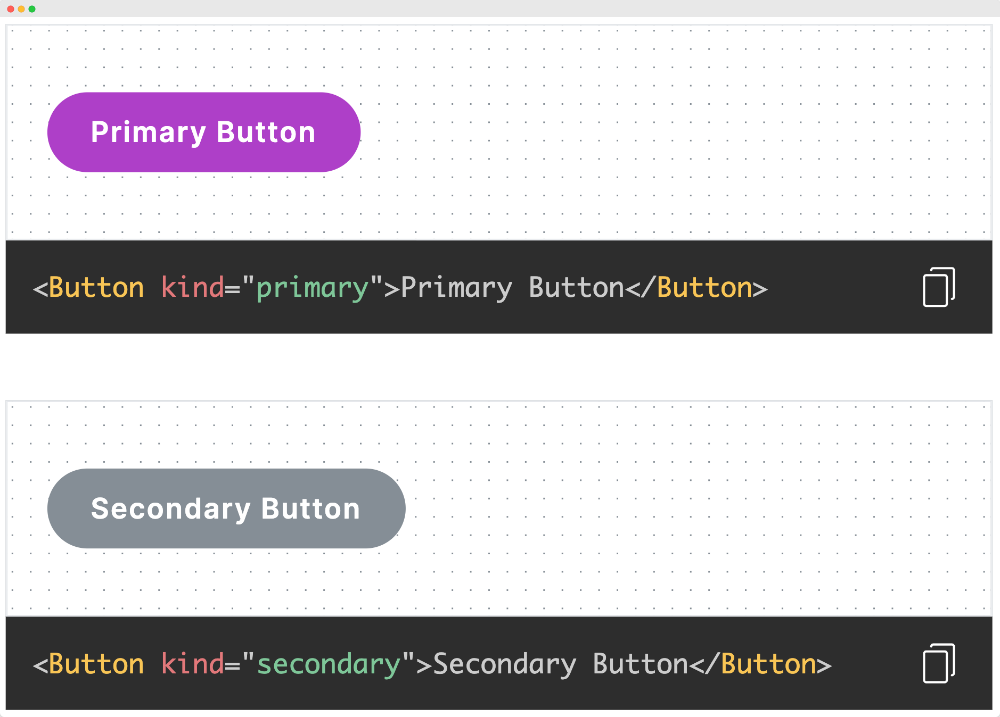

<p align="center">
  
</p>
<h1 align="center">
  Gatsby Starter Design System
</h1>

[](https://app.netlify.com/sites/gatsby-starter-design-system/deploys)
<a href="https://github.com/altenull/gatsby-starter-design-system/blob/master/LICENSE">
  
</a>


**Build your design system website with a simple, intuitive and customizable code highlighter.**

## 🚀 Quick start

You need to have `gatsby-cli` installed: `npm install -g gatsby-cli`.

1.  **Create a Gatsby site.**

    Use the Gatsby CLI to create a new site, specifying the _design-system_ starter.

    ```sh
    # create a new Gatsby site using the design-system starter
    gatsby new my-design-system https://github.com/altenull/gatsby-starter-design-system
    ```

1.  **Start developing.**

    Navigate into your new site’s directory and start it up.

    ```sh
    cd my-design-system/
    gatsby develop
    ```

1.  **Open the source code and start editing!**

    Check out your site at `http://localhost:8000`!

    _Note: You'll also see a second link: _`http://localhost:8000/___graphql`_. This is a tool you can use to experiment with querying your data. Learn more about using this tool in the [Gatsby tutorial](https://www.gatsbyjs.org/tutorial/part-five/#introducing-graphiql)._

    Open the `my-design-system` directory in your code editor of choice and edit `src/pages/index.js`. Save your changes and the browser will update in real time!


## 👀 Live Demo
See a [demo](https://gatsby-starter-design-system.netlify.app/) hosted on Netlify.

## ✨ Code Highlighter

We provides a customizable code highlighter with code block copy feature. And you can also change the theme of it.



### gatsby-remark-prismjs

We uses [gatsby-remark-prismjs](https://www.gatsbyjs.com/plugins/gatsby-remark-prismjs/) plugin to highlight the code blocks in markdown files. Since [gatsby-remark-prismjs](https://www.gatsbyjs.com/plugins/gatsby-remark-prismjs/) is based on [PrismJS](https://prismjs.com/), you can change the theme from the [list](https://prismjs.com/).

* tomorrow night **(default theme)**.

### Customizing

The [```ComponentDemoViewer.js```](./src/components/code/ComponentDemoViewer.js) and [```CodeHighlighterContainer.js```](./src/containers/code/CodeHighlighterContainer.js) are core components that view demo and highlight the code blocks in markdown files. In these components, you can customize the styles of demo viewer and animating of copy icon.

## 📝 License

Licensed under the [0BSD](./LICENSE).